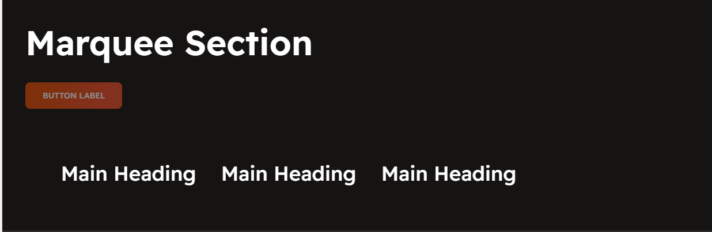
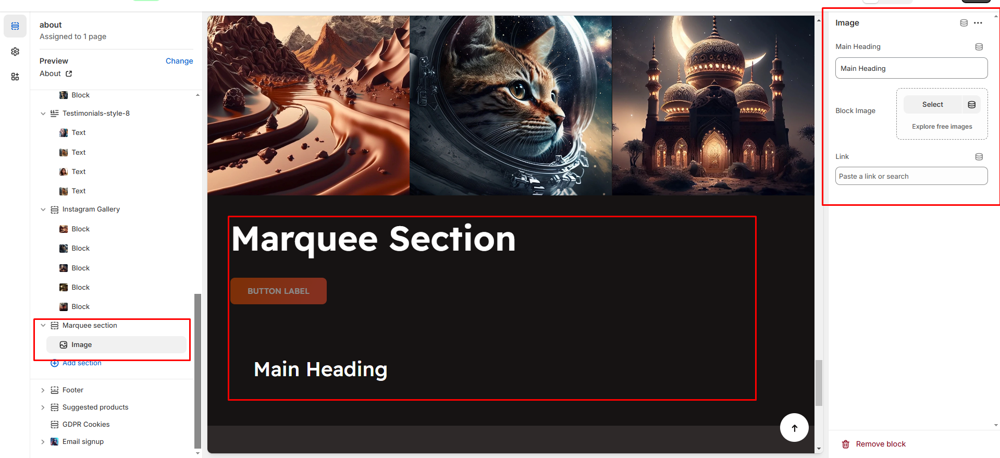

# Marquee Section

The **Marquee Section** allows you to create a scrolling text or image effect, making it ideal for **announcements, brand highlights, or promotional messages**.

<figure><figcaption></figcaption></figure>


* **Go to** Shopify Admin > **Online Store > Themes**.
* Click **Customize** on your active theme.
* In the Theme Editor, click **Add Section > Marquee Section**.


* **Show Full Width:** Expands the section across the entire screen width.&#x20;
* **Right & Left Spacing :** Add **spacing** to the **Full Width** layout (applies  in full-width mode).
* **Heading:** Set a custom title (e.g., "Hot & Top Trends").&#x20;
* **Heading Size:** Choose for size Small, Medium, or Large&#x20;
* **Subheading:** Add additional text if needed.&#x20;
* **Body Text:** Add a description (e.g., "Best arrivals this week").&#x20;
* **Button Label:** Add text (e.g., "Shop Now").&#x20;
* **Button Link:** Set the URL destination.
* **Color scheme :** You can customize the section’s appearance by changing the **text color, background color**, and more using preset color options.
* **Use outline button style:** Change the button to an outlined style.
* &#x20;**Column alignment:** Column can be aligned as per the content alignment requirement (Left,Right)
* **Animation Speed:**&#x43;an Adjust the speed of the marquee animation as slow,medium,fast
* **Enable Reverse Animation:** Reverse animation refers to **playing an animation backward**, meaning the final state returns to the initial state in a reversed motion
* **Layout Style:**&#x43;an style the marquee as with separator line or border it can be with border using the given option **(Default, Boxed, With Seperator)**
* **Padding:** Top Padding and Bottom Padding are used to adjust the spacing above and below a section in Shopify, improving the layout and readability.
* **Custom class:** The Shopify allows you to apply unique CSS styles to specific sections, blocks, or elements within your theme.


Without adding block to marquee the section seems to be empty


<figure><figcaption></figcaption></figure>

* **Main Heading:** Enter the marquee text (**e.g., "New Arrivals Available Now!"**).
* **Block Image:**&#x55;pload the image for the marquee block
* **Link:** The content can be linked by adding Url using link option\
