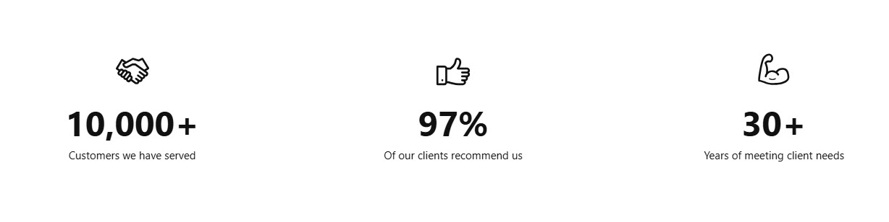

# Number Counter

The **Number Counter Section** allows you to showcase **animated statistics, milestones, or achievements**, making it ideal for **displaying company growth, customer success metrics, or key performance figures**.


* **Go to** Shopify Admin > **Online Store > Themes**.
* Click **Customize** on your active theme.
* In the Theme Editor, click **Add Section > Number Counter**.


<figure><figcaption></figcaption></figure>

* **Show Full Width:** Expands the section across the entire screen width.&#x20;
* **Right & Left Spacing :** Add **spacing** to the **Full Width** layout (applies  in full-width mode).
* **Heading:** Set a custom title (e.g., "Hot & Top Trends").&#x20;
* **Heading Size:** Choose for size Small, Medium, or Large&#x20;
* **Subheading:** Add additional text if needed.&#x20;
* **Description:**  Add a description (e.g., "Best arrivals this week").
* &#x20;**Button Label:** Add text (e.g., "Shop Now").&#x20;
* **Button Link:** Set the URL destination.
* **Use Outline Button style:** Change the button to an outlined style.&#x20;
* **Column alignment:** Column can be aligned as per the content alignment requirement (Left,Center)
* &#x20;**Color scheme :** You can customize the section’s appearance by changing the **text color, background color**, and more using preset color options.
* **Number of columns on desktop:**&#x49;t is used to make adjustment with column on desktop
* **Padding:** Top Padding and Bottom Padding are used to adjust the spacing above and below a section in Shopify, improving the layout and readability.
* **Image:** Add a high-quality image that appears on the left side of the section&#x20;

<figure><figcaption></figcaption></figure>


Without adding block to number counter the section seems to be empty


* Click **Add image** to insert a new statistic.
* **Heading:**&#x41;dds the title to number counter block
* **Description:** Provide context for the number counter block
* **Value:** Enter the value (**e.g., 50**).
* **Value Text:** Add a suffix (**e.g., "K" for 50K customers**).
* **Column Alignment:** Choose **Left or center** for the content placement in block.
