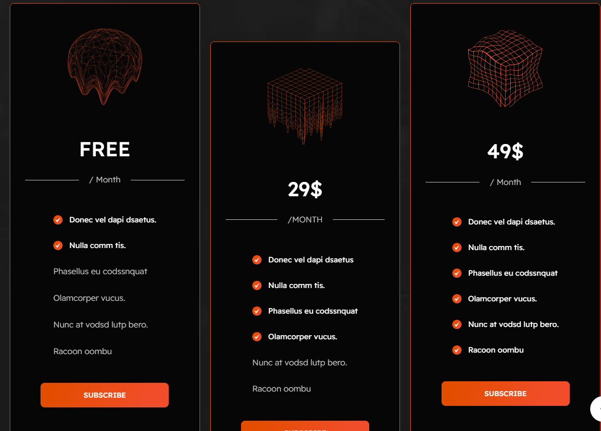
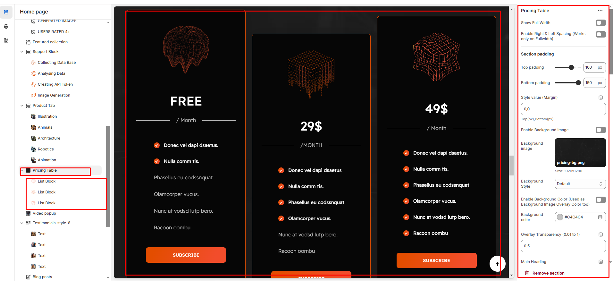

# Pricing table

A Pricing Table section in Shopify is used to display different pricing plans, product comparisons, or service packages in a structured way. It helps customers easily understand what each plan or product offers.\

<figure><figcaption></figcaption></figure>


* Go to **Online Store > Themes > Customize.**
* Click Add section and search for Pricing Table (if available in your theme).
* Click **Save and preview** your changes.


### Customization Options

* **Show Full Width:**  Expands the section across the entire screen width.
* **Right & Left Spacing :**  Add spacing to the Full Width layout (applies  in full-width mode).
* **Heading:**  Set a custom title (e.g., "Pricing Table").
* **Heading Size:** Choose for size Small, Medium, or Large
* **Subheading:** Add additional text if needed.
* **Body Text:**  Add a description (e.g., "Best arrivals this week").
* **Button Label:**  Add text (e.g., "Shop Now").
* **Button Link:**  Set the URL destination.
* **Color scheme :** You can customize the section’s appearance by changing the text color, background color, and more using preset color options.
* **Background-image :** Upload or select the image you want to use as the background for the image block.
* **Enable Outline Button:** Change the button to an outlined style.
* **Column alignment:** Column can be aligned as per the content alignment requirement (Left,Right)
* **Number of columns on desktop:** Display the brand image  per column
* **Block color setting:** Display color of the block
* **Item per row:** Choose between 1 to 4 blocks to customize your design layout.
* **Padding:** Top Padding and Bottom Padding are used to adjust the spacing above and below a section in Shopify, improving the layout and readability.
* **Custom class:** The Shopify allows you to apply unique CSS styles to specific sections, blocks, or elements within your theme.

<figure><figcaption></figcaption></figure>


Each block allows you to create structured content with the following customizable options:


* **Image :** Add an image to visually represent the content.
* **Heading :** Set the main title for the block.
* **Description :** Provide additional details or supporting text.
* **Button:** Add a clickable button for actions (e.g., "Subscribe").
* P**rimary Text (with checkbox) :** Enables a highlighted main text for emphasis.
* **Secondary Text (without checkbox) :** Adds additional supporting text without highlighting.
