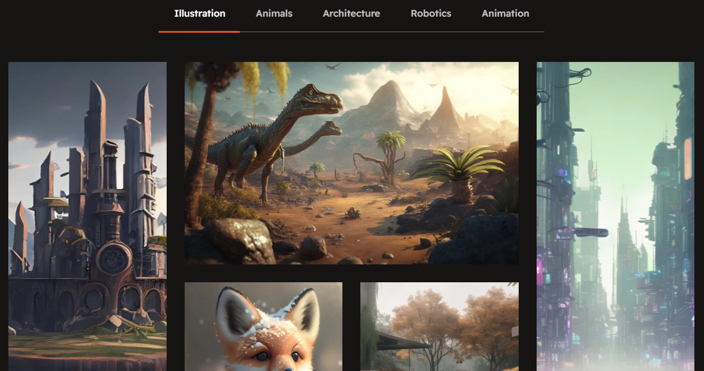
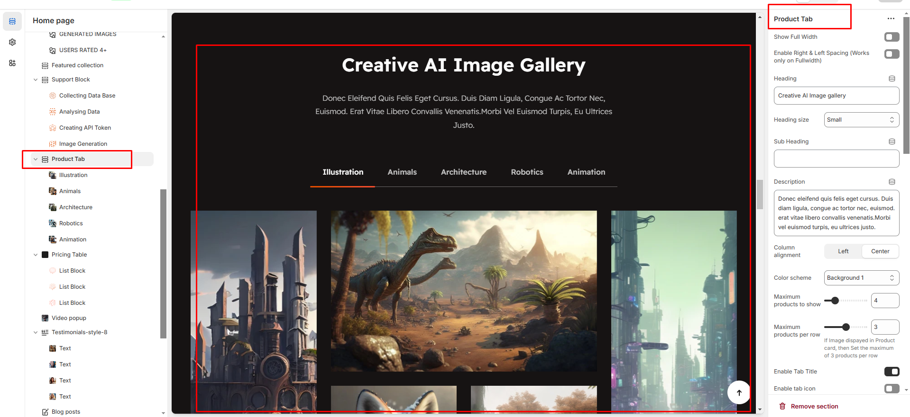

# Product tab

The Product Tab Section allows you to organize and display detailed information about your product in separate tabs . Below are the available customization options:

<figure><figcaption></figcaption></figure>


* Go to **Online Store > Themes > Customize.**
* Click Add section and search for **Product tab**  (if available in your theme).
* Click **Save** and preview your changes.


* **Show Full Width :** Expands the section to the full width of the page.
* **Enable Right & Left Spacing :**  Adds spacing on both sides (works only in full-width mode).
* **Heading :** Sets the main title of the section.
* **Heading Size :** Adjusts the size of the heading (Small, Medium, Large).
* **Subheading :** Adds a short description below the heading.
* **Description :** Allows additional text to explain the section’s purpose.
* **Column Alignment :**  Aligns content to the left or center.
* **Color Scheme :** Selects the background or text color styles.
* **Maximum Products to Show :** Sets the total number of products displayed in this section.
* **Maximum Products per Row :** Defines how many products appear in a single row (up to 3).
* **Enable Tab Title :** Displays category names as clickable tabs.
* **Enable Tab Icon :**  Allows adding icons next to tab names.
* **Enable "View All"** Shows a "View All" button if the collection has more products
* **Image Ratio:** Choose how your product images look (square, adapt to image, portrait). "Adapt to image" means the image will fit its natural shape.
* **Desktop Layout:** This controls where the product image and its accompanying information (like title, price, description) are arranged. You have a dropdown menu with options like:
* **Image first:** The image appears first and the product appears second
* **Product first:** The product appears first and the image appears second
* **None :** To show only the tab product content and hide the image
* **Horizontal Position:** Choose Left, Center, or Right to align the element's sides.
* **Vertical Position:** Choose Top, Middle, or Bottom to align the element's top and bottom.

<figure><figcaption></figcaption></figure>


The Product Tab Block allows you to organize and display different types of content in separate tabs.


* **Tab Heading:** You can add a heading for each tab. This is the title of the tab (e.g., " Tab heading’").
* **Image Block:** You can add an image to each tab. This image can be related to the content of the tab (e.g., product images.).
* **Title:** Each tab can have a title. You can set a title for the content displayed in that tab (e.g., "Product Features").
* **Title Link:** You can provide a link for the title. This link will direct customers to another page or section related to that title.
* **Description:** Each tab can contain a description. This text can describe the product's features, details, or any other relevant information that you want to display in that tab.
