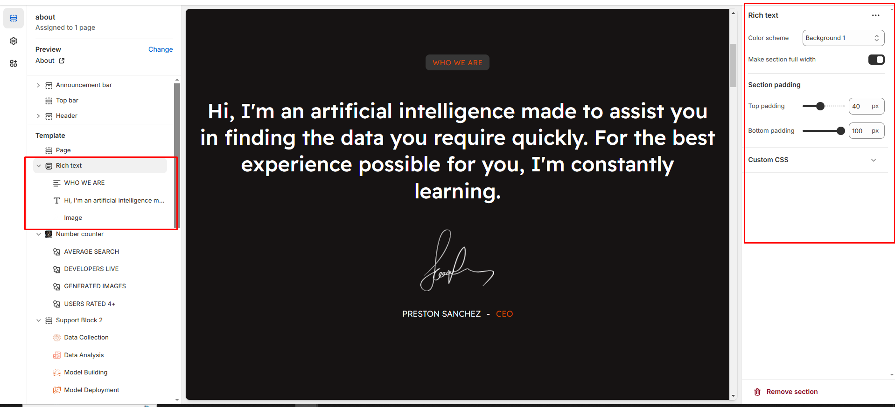

# Rich text

The **Image with Text Section** allows you to pair an image with descriptive content, making it ideal for showcasing **products, promotions, or brand messages**.

<figure><figcaption></figcaption></figure>


* **Go to** Shopify Admin > **Online Store > Themes**.
* Click **Customize** on your active theme.
* In the Theme Editor, click **Add Section > Rich Text**.


* **Color scheme :** You can customize the section’s appearance by changing the **text color, background color**, and more using preset color options.
* **Right & Left Spacing :** Add **spacing** to the **Full Width** layout (applies  in full-width mode).
* **Padding:** Top Padding and Bottom Padding are used to adjust the spacing above and below a section in Shopify, improving the layout and readability.


Without adding block to rich text the section seems to be empty limit of the block is 5


* **Text:** To add description or subtitle to the block
* **Heading:** To add the Title to the block
* **Heading Size:** Choose for size Small, Medium, or Large
* **Image:** To upload the image and Author name and author designation to the block&#x20;
* **Buttons:** Button Label Add text (e.g., "Shop Now").& Button Link Set the URL destination.

<figure><figcaption></figcaption></figure>
