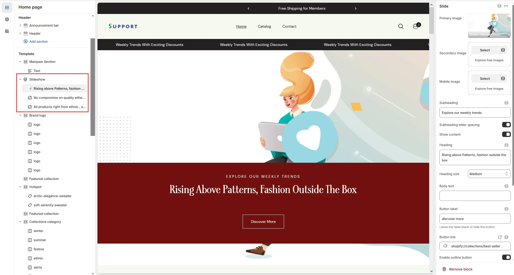
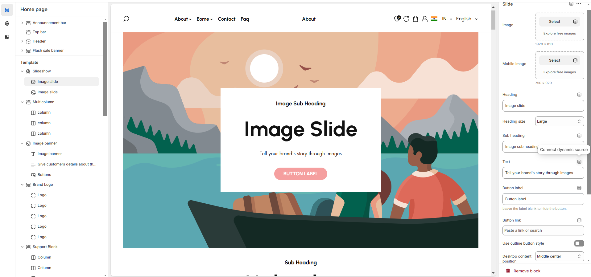

# Slideshow

The **Slideshow Section** allows you to display multiple images or banners in a rotating format, making it ideal for highlighting promotions, featured products, or key brand messages.

<figure><figcaption></figcaption></figure>


* Go to **Shopify Admin > Online Store > Themes.**
* **Click** Customize on your live theme.
* In the theme editor, **Click** **Add Section > Slideshow**.


<figure><figcaption></figcaption></figure>

* **Show Full Width:** Expands the section across the entire screen width.
* **Right & Left Spacing :** Add **spacing** to the **Full Width** layout (applies  in full-width mode).
* **Slide Height:** Choose from **Small, Medium, or Large,Adapt to first.**
* **Navigation (Arrows) / Pagination dot:** Enable the arrow navigation and pagination of the section on enable .
* **Auto Play Interval:** Set automatic slide transition timing.
* **Slide effects:**&#x53;lideshow slides come with 2 effects slide and fade animation effects.


Adding a **block** will display the **image and content.** Without the block, the slideshow remains empty.Can also remove and add block as per the theme requirement.


* **Image:** Upload the main slideshow image to view in desktop.
* **Mobile Image:** Upload a  that to be view in mobile version.
* **Heading:** Adding title to the content on slideshow block
* **Subheading:** Add a short text to the content
* **Body Text:** Add a description or supporting text.
* **Button Label:** Set the text of action clickable
* **Button Link:** Add a destination URL.
* **Use Outline Button style:** Change the button style to an outlined version.
* **Desktop Content Position:** Choose alignment of given option there are different option for positioning(**Top, Bottom,Center**).& its alignment as left,right,center
* **Image overlay opacity:** Can adjust the opacity of overlay image.
* **Show Container on Desktop:** Display content in a structured container.
* **Text Alignment (Desktop):** Adjust content placement within the slide.**(Left,Right,Center)**
* **Mobile Content Alignment:** Optimize text placement for smaller screens.**(Left,Right,Center)**
* **Color scheme :** You can customize the section’s appearance by changing the **text color, background color**, and more using preset color options.

<figure><figcaption></figcaption></figure>

***

