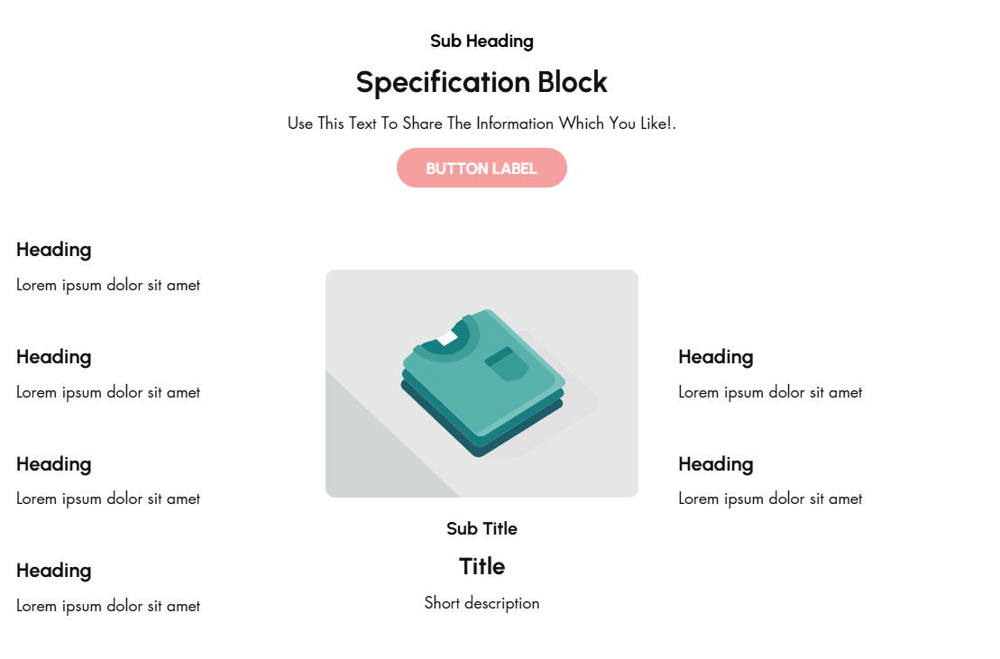
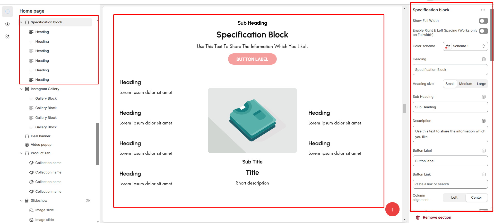
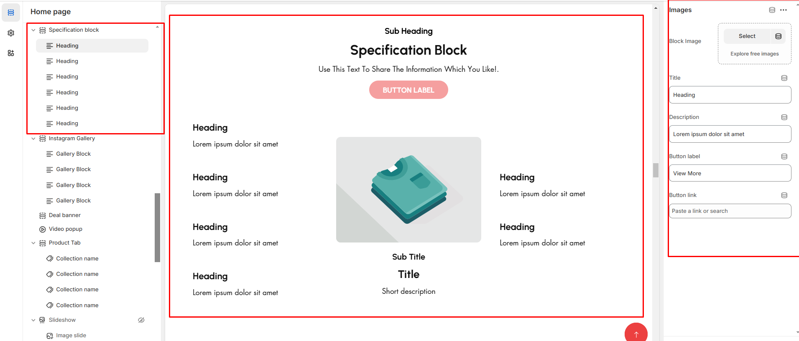

# Specification Block / Specification

A **Specification Block** in Shopify is typically used to provide detailed information about a product's features, specifications, or technical details. This is especially useful for products that require detailed descriptions, such as electronics, appliances, or apparel with unique attributes.

<figure><figcaption></figcaption></figure>


* Navigate to **Online Store > Themes > Live Theme > Customize**.
* **Add Section**: In the Customizer, select **Add Section > Specification Block**.


* **Show Full Width:** Expands the top bar across the entire screen width.
* &#x20;**Right & Left Spacing :** Add **spacing** to the **Full Width** layout (applies  in full-width mode).
* **Heading:** Set a custom title **(e.g., "Specification block").**
* &#x20;**Heading Size:** Choose for size Small, Medium, or Large&#x20;
* **Subheading:** Add additional text if needed. Body Text: Add a description **(e.g., "Best arrivals this week").**&#x20;
* **Button Label:** Add text **(e.g., "Shop Now").**&#x20;
* **Button Link:** Set the URL destination.&#x20;
* &#x20;**Use Outline Button style:** Change the button to an outlined style.&#x20;
* **Column alignment:** Column can be aligned as per the content alignment requirement (Left,Right)
* **Content alignment:** The content alignment of the information is done
* **Color scheme :** You can customize the section’s appearance by changing the **text color, background color**, and more using preset color options.

<figure><figcaption></figcaption></figure>

### **Main Block:**

* **Enable Image**: Enable the main block image
* **Primary Image**:  upload image for main banner
* **Titles**: Add main **Title**, **Subtitle**, and **Short Description**.
* **Buttons**: Add label and link.
* **Banner Text Alignment**: Set to Content alignment as **(Left,Right, Center)**
* **Vertical position:**&#x54;o align the content vertical position **(Left,Right, Center)**
* **Banner Style**: Add Grid or overlay style to banner
* **specification style:** Some style are predefine and designed can select as per requirement **(style1, style2, style3)**
* **Minimum height:** The height is for overlay main banner image
* **Banner position:** Can position the banner in **(Top, bottom,middle )** with the alignment of **(Center,Left,Right)**
* **Content Reverse:**&#x4F;n enable the Position of the content is row-reverse or column reversed.

### Additional Block Heading:

* **Titles**: Add main **Title**, **Subtitle**, and **Short Description**.
* **Additional Text Alignment**: Set to Content alignment as **(Left,Right, Center)**
* **Additional Button & Additional label** : Add label and link.
* **Padding:** Top Padding and Bottom Padding are used to adjust the spacing above and below a section in Shopify, improving the layout and readability.


Without adding block to specification section it display only the main image


* **Block image:**&#x55;pload the additional image to block
* **Titles**: Add main **Title**, **Subtitle**, and **Short Description**.
* **Button & label** : Add label and link.

<figure><figcaption></figcaption></figure>
