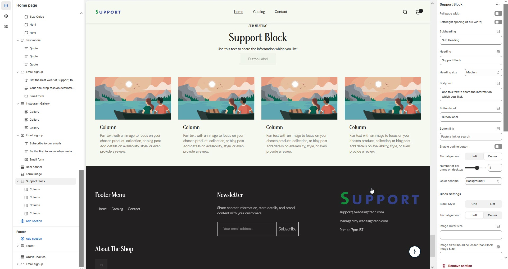
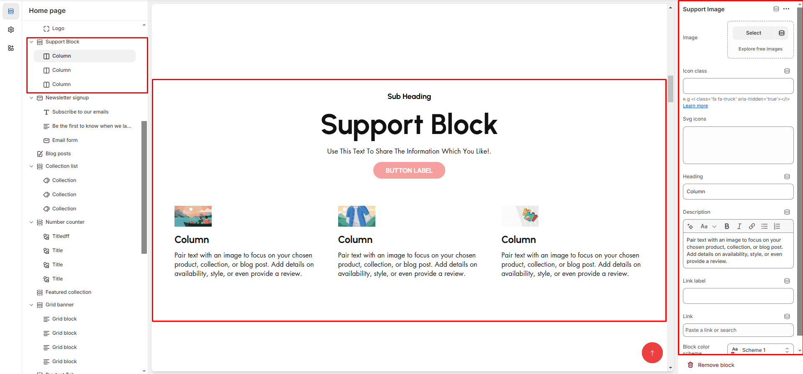

# Support Block

The **Support Block** is designed to assist users in quickly accessing help and resources related to the theme.

<figure><figcaption></figcaption></figure>


* Navigate to **Shopify Admin > Online Store > Themes**.
* **Click** Customize on your active theme.
* **In the Theme Editor**, click **Add Section >** Support Block


* **Show Full Width:** Expands the section across the entire screen width.
* **Right & Left Spacing :** Add **spacing** to the **Full Width** layout (applies  in full-width mode).
* **Heading:** Customize the section title (**e.g., "Support Block"**).
* **Heading Size:** Choose from **Small, Medium, or Large** (**Default: Medium**).
* **Subheading:** Add a short introductory text.
* **Body Text:** Provide additional details about the section (**e.g., "Use this text to share the information you like!"**).
* **Button Label:** Customize the button text
* **Button Link:** Add a destination URL.
* **Use Outline Button style:** Toggle between solid and outlined button styles.
* **Column Alignment:** Adjust content placement within the sectio&#x6E;**.(Left,Right,Center)**
* **Number of Columns (Desktop):** Choose the number of columns for desktop layout.
* **Color scheme :** You can customize the section’s appearance by changing the **text color, background color**, and more using preset color options.

<figure><figcaption></figcaption></figure>

* **Block Style:** Customize how the blocks are displaye&#x64;**(Grid,List)**.
* **Block alignment:** The content in block can be aligned using block alignment **(Left, Center, Right)**&#x20;
* **Image Outer Size:** Adjust the image size within the block.
* **Image Size (Should Be Smaller than Block Image Size):** Ensures proportional scaling.
* **Image Radius (in px):** Set to **50%** for a rounded image effect.
* **Vertical Position (Not for Grid Style):** Adjust text positioning ( **Vertical Center, Vertical Top, Vertical Bottom**).
* **Padding:** Top Padding and Bottom Padding are used to adjust the spacing above and below a section in Shopify, improving the layout and readability.
* **Slider option:** The **range for displaying products** can be adjusted based on the device type (**Desktop, Laptop, Tablet, and Mobile**) to ensure a responsive layout.
* **Pagination (Dots):** Show navigation dots for better user interaction.
* **Navigation (Arrows):** Enable left/right navigation arrows.
* **Auto Play Interval:** Set the time delay between slides.
* **Enable Swipe on mobile:** Allow users to swipe through blocks on touch devices.
* **Enable Controls:** Display manual navigation options.
* **Column on mobile:** Adjust based on mobile screen size can adjust to 1 column or 2 column.(works only the mobile swiper works)

<figure><figcaption></figcaption></figure>


If **no block is added**, only the **heading** will be displayed in the Support Section. To show content, at least **one block** must be added.


* **Image:** Add an image related to the support feature.
* **Icon class:** Use an icon instead of an image as font-awsome format .
* **Heading:** Enter the column title (**e.g., "24/7 Customer Support"**).
* **Description:** Provide details (**e.g., "Pair text with an image to focus on your chosen product, collection, or blog post."**).
* **Link Label:** Set the text of action clickable
* **Link:** Add a destination Url

<figure><figcaption></figcaption></figure>

