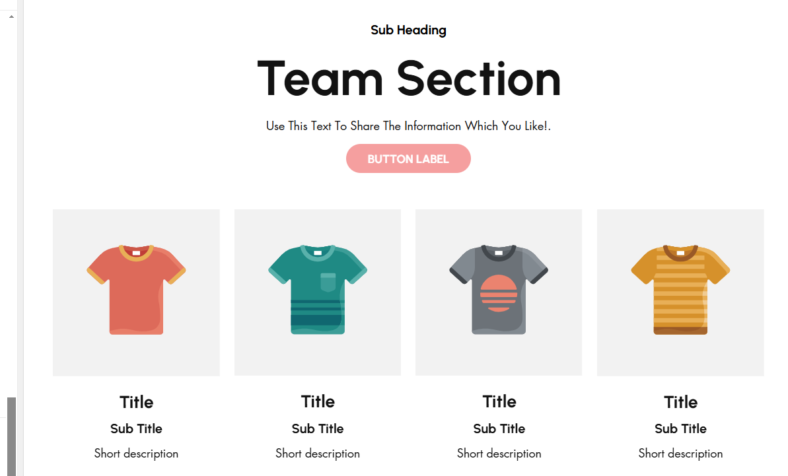
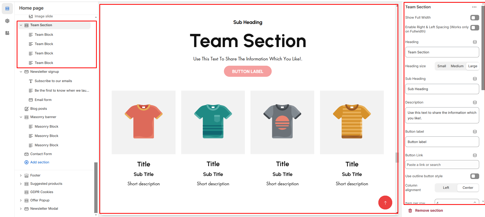
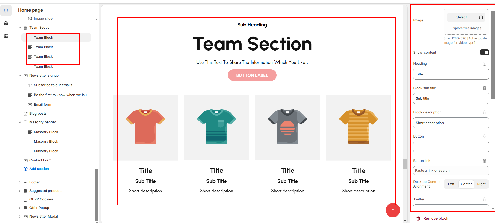

# Team Section

A **Team Section** in Shopify allows you to showcase the members of your team, adding a personal touch to your store and building trust with customers. This section typically includes photos, names, job titles, and brief bios of your team members.

<figure><figcaption></figcaption></figure>


* **Go to** Shopify Admin > **Online Store > Themes**.
* Click **Customize** on your active theme.
* In the Theme Editor, click **Add Section > Team Section**.


* **Show Full Width:** Expands the section across the entire screen width.&#x20;
* **Right & Left Spacing :** Add **spacing** to the **Full Width** layout (applies  in full-width mode).
* **Heading:** Set a custom title (e.g., " **Team section** ").
* &#x20;**Heading Size:** Choose for size Small, Medium, or Large&#x20;
* **Subheading:** Add additional text if needed.&#x20;
* **Body Text:** Add a description (e.g., "Best arrivals this week").
* &#x20;**Button Label:** Add text (e.g., "Shop Now").
* &#x20;**Button Link:** Set the URL destination.&#x20;
* **Use Outline Button style:** Change the button to an outlined style.
* &#x20;**Column alignment:** Column can be aligned as per the content alignment requirement (Left,Center)
* **Secondary background:**&#x41;llow to enable the background or display none the bacakground
* **Items Per Row:** Set the number of team members displayed per row (**Default: 4**).
* **Color scheme :** You can customize the section’s appearance by changing the **text color, background color**, and more using preset color options.
* **Padding:** Top Padding and Bottom Padding are used to adjust the spacing above and below a section in Shopify, improving the layout and readability.
* [**Custom class:**](custom-class.md) The Shopify allows you to apply unique CSS styles to specific sections, blocks, or elements within your theme.&#x20;
* **Slider option:** The range for displaying products can be adjusted based on the device type **(Desktop, Laptop, Tablet, and Mobile)** to ensure a responsive layout.
* **Centered slide:** On enabling the slider and center mode the content of the section to be in center &#x20;
* &#x20;**Pagination (Dots):** Show navigation dots for better user interaction.
* &#x20;**Navigation (Arrows):** Enable left/right navigation arrows.&#x20;
* **Auto Play Interval:** Set the time delay between slides.

<figure><figcaption></figcaption></figure>

### **Adding Team Members**


Without adding block to Team section the section seems to be empty


* **Image:** Upload the image of the team members
* **Show Content:** Toggle to display member details.
* **Heading:** Enter the team member’s name.
* **Subtitle:** Add the job title or role.
* **Block description:** Provide a short bio or description.
* **Button Label:** Add text (e.g., "Shop Now").
* &#x20;**Button Link:** Set the URL destination.
* **Text Alignment (Desktop):** Adjust the placement of text for better readability.**(Left,Center,Right)**

<figure><figcaption></figcaption></figure>

### **Social Media Links**

* **Twitter:** Add a profile link (**e.g.,** [**https://twitter.com/shopify**](https://twitter.com/shopify)).
* **Facebook:** Add a profile link (**e.g.,** [**https://facebook.com/shopify**](https://facebook.com/shopify)).
* **Pinterest:** Add a profile link (**e.g.,** [**https://pinterest.com/shopify**](https://pinterest.com/shopify)).
* **Instagram:** Add a profile link (**e.g.,** [**https://instagram.com/shopify**](https://instagram.com/shopify)).
* **YouTube:** Add a profile link (**e.g.,** [**https://youtube.com/shopify**](https://youtube.com/shopify)).
