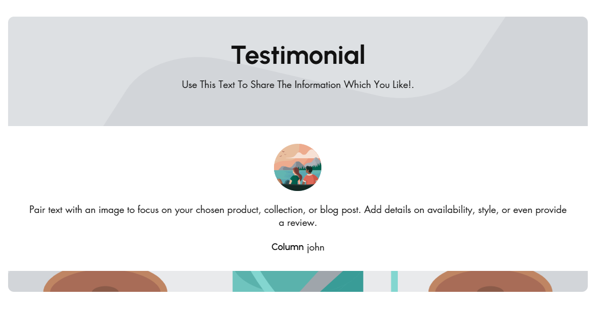
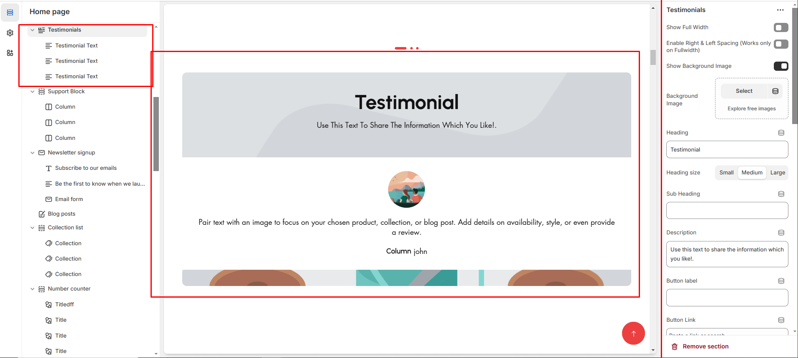
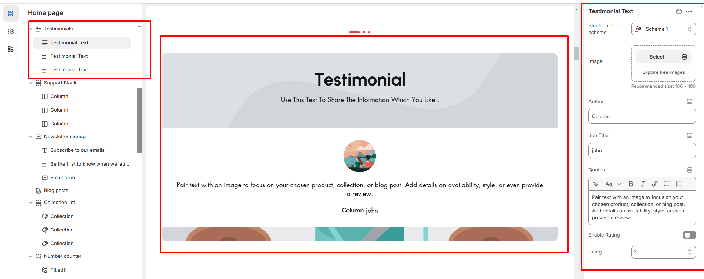

# Testimonial

The **Testimonial Section** allows you to display customer reviews, enhancing credibility and trust. It supports **images, quotes, author details, and product links** in a structured format.


* **Go to** Shopify Admin > **Online Store > Themes**.
* Click **Customize** on your active theme.
* In the Theme Editor, click **Add Section > Testimonial**.


<figure><figcaption></figcaption></figure>

* **Show Full Width:** Expands the section across the entire screen width.&#x20;
* **Right & Left Spacing :** Add **spacing** to the **Full Width** layout (applies  in full-width mode).
* **Background Image:** Upload a custom image for the testimonial section.
* **Subheading:** Add a short introductory text.
* **Heading:** Set a custom title (e.g., "Hot & Top Trends").
* &#x20;**Heading Size:** Choose for size Small, Medium, or Large&#x20;
* **Subheading:** Add additional text if needed.
* &#x20;**Body Text:** Add a description (e.g., "Best arrivals this week").
* &#x20;**Button Label:** Add text (e.g., "Shop Now").&#x20;
* **Button Link:** Set the URL destination.&#x20;
* **Column alignment:** The column alignment  apply  to header content of the testimonial&#x20;
* **Content alignment:** The content alignment of the information is done&#x20;
* **Use Outline Button style:** Change the button to an outlined style.&#x20;
* **Color scheme :** You can customize the section’s appearance by changing the **text color, background color**, and more using preset color options
* **Padding:** Top Padding and Bottom Padding are used to adjust the spacing above and below a section in Shopify, improving the layout and readability.&#x20;
* **Slider option:** The **range for displaying products** can be adjusted based on the device type (**Desktop, Laptop, Tablet, and Mobile**) to ensure a responsive layout.
* **Pagination (Dots):** Show navigation dots for better user interaction.
* **Center mode:** Allow the first content center while the slider is enabled&#x20;
* **Navigation (Arrows):** Enable left/right navigation arrows.
* **Auto Play Interval:** Set the time delay between slides.
* [**Custom class:**](custom-class.md) The Shopify allows you to apply unique CSS styles to specific sections, blocks, or elements within your theme.

<figure><figcaption></figcaption></figure>


Without adding block to testimonial the section seems to be empty


* &#x20;**Image:** Upload the image of the author
* **Author:** Enter the author name
* **Job Title:** Enter author job designation
* **Quote:** Enter the descrption to the content
* **Rating :** Enter the rating to the content from 1 to 5
* **Link label:** Allows t add button label to testimonial content
* **Link:** Add link url to the buton label

<figure><figcaption></figcaption></figure>

