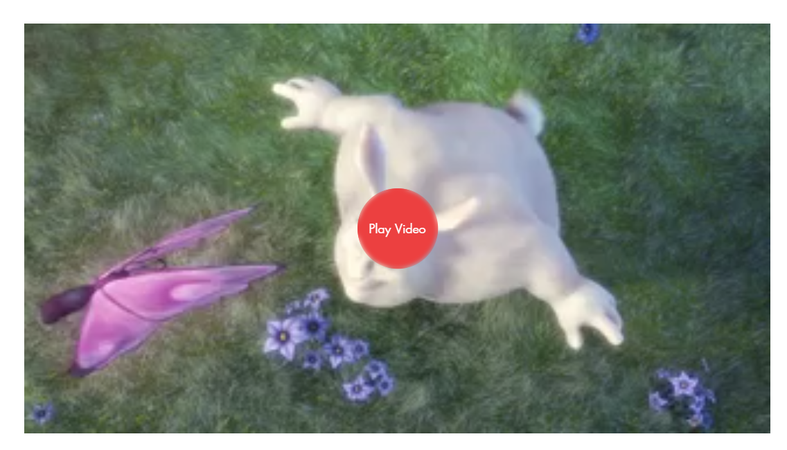
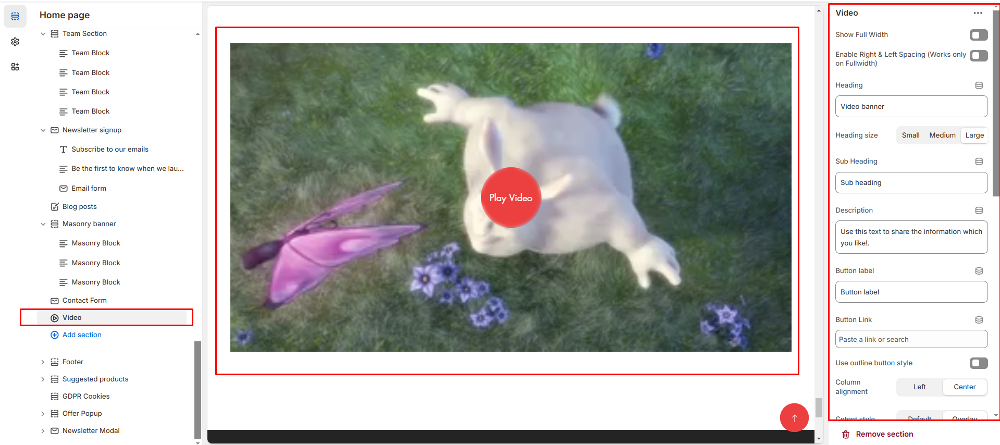

# Video

The **Video Banner Section** allows you to showcase **videos in a full-width banner format**, ideal for promotions, storytelling, or brand highlights.

<figure><figcaption></figcaption></figure>


* **Go to** Shopify Admin > **Online Store > Themes**.
* Click **Customize** on your active theme.
* In the Theme Editor, click **Add Section > Video Banner**.


* **Show Full Width:** Expands the section across the entire screen width.&#x20;
* **Right & Left Spacing :** Add **spacing** to the **Full Width** layout (applies  in full-width mode).
* **Heading:** Set a custom title (e.g., "video").&#x20;
* **Heading Size:** Choose for size Small, Medium, or Large&#x20;
* **Subheading:** Add additional text if needed.&#x20;
* **Body Text:** Add a description (e.g., "Best arrivals this week").&#x20;
* **Button Label:** Add text (e.g., "Shop Now").&#x20;
* **Button Link:** Set the URL destination.
* **Use Outline Button style:** Change the button to an outlined style.&#x20;
* **Column alignment:** Column can be aligned as per the content alignment requirement (Left,Right)
* **Content style:** Content style are **(Default, Overlay ).** Can choose according to the theme
* **Cover Image:**&#x55;pload an image for the video thumbnail (shown before playback).
* **Video URL:** Provide a **YouTube or Vimeo link** for embedded videos.
* **Video alt text:**&#x41;dding text in alternate to video
* **URL:** Provide a **YouTube or Vimeo link** for embedded videos.
* **Padding:** Top Padding and Bottom Padding are used to adjust the spacing above and below a section in Shopify, improving the layout and readability.
* **Color scheme :** You can customize the section’s appearance by changing the **text color, background color**, and more using preset color options.
* [**Custom class:** ](custom-class.md)The Shopify allows you to apply unique CSS styles to specific sections, blocks, or elements within your theme.

<figure><figcaption></figcaption></figure>
