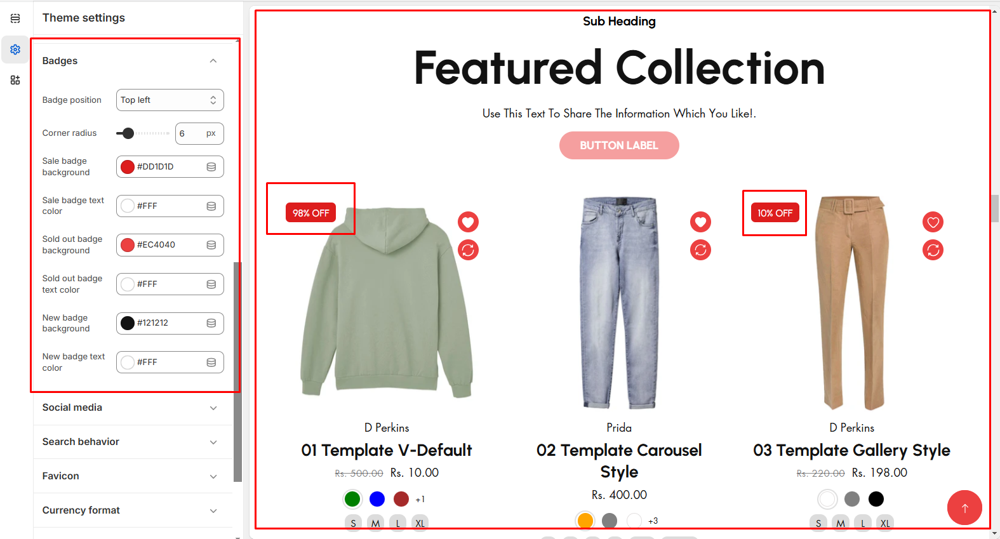

# Badges

In the badges section, you can customize the **Badge position** and **Corner radius** and also you can change the **Background Colour** theme, and **Text color** for the **Sale, Sold, and a New badge.**


**Step 1** : From your Shopify admin, go to **Online Store > Themes**.

**Step 2** : Find the theme that you want to **Edit and click Customize**.

**Step 3** : Click **Theme Settings.**

**Step 4 : Theme Settings > Badges.**


<figure><figcaption></figcaption></figure>
