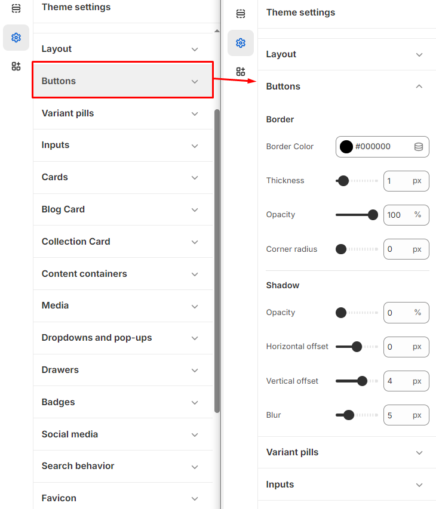
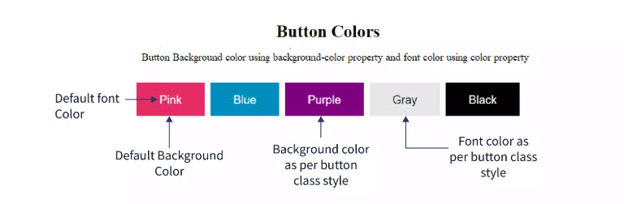

# Buttons

Buttons in Shopify are interactive elements that guide customers through your store, enabling actions like **adding to cart, checking out, or navigating pages**.


**Step 1** : From your Shopify admin, go to **Online Store > Themes**.

**Step 2** : Find the theme that you want to **Edit and Click Customize.**

**Step 3** : Click **Theme Settings.**

**Step 4 : Theme Settings > Buttons**


### Border customization's 

* **Border:** In the Border section, you can select the desired color for the button border, and customize its thickness, opacity, and corner radius. In CSS, this is represented as: **border: 1px solid \[border-color]** Here, 1px defines the thickness, solid is the common border style, and \[border-color] is the color you choose. You can also adjust the border's opacity and corner radius for further customization:
* **Opacity**: This can be controlled using rgba() for the color value, where the a represents alpha (opacity). Eg: **border: 2px solid rgba(255, 0, 0, 0.5); /\***
* **Corner Radius**: The border corners can be rounded using the border-radius property. Eg:**border-radius: 10px;**
* **Shadow:** In the Shadow section, you can adjust the Opacity, Horizontal offset, Vertical offset, and Blur of the button's shadow. These settings allow you to control how light or dark the shadow appears, as well as its position and softness.This is used to set a box-shadow for the button in CSS. The syntax looks like this:Eg: **Box-shadow: \[horizontal-offset] \[vertical-offset] \[blur-radius] \[spread-radius] \[color];**

### Box shadow customization's 

* **Horizontal offset**: Moves the shadow left or right.
* **Vertical offset**: Moves the shadow up or down.
* **Blur radius**: Determines how blurry the shadow is.
* **Spread radius**: Controls the size of the shadow.
* **Color**: Specifies the shadow color, where you can use rgba to adjust opacity.
* **Eg; box-shadow: 4px 4px 8px rgba(0, 0, 0, 0.2);**

<figure><figcaption></figcaption></figure>

<figure><figcaption></figcaption></figure>
