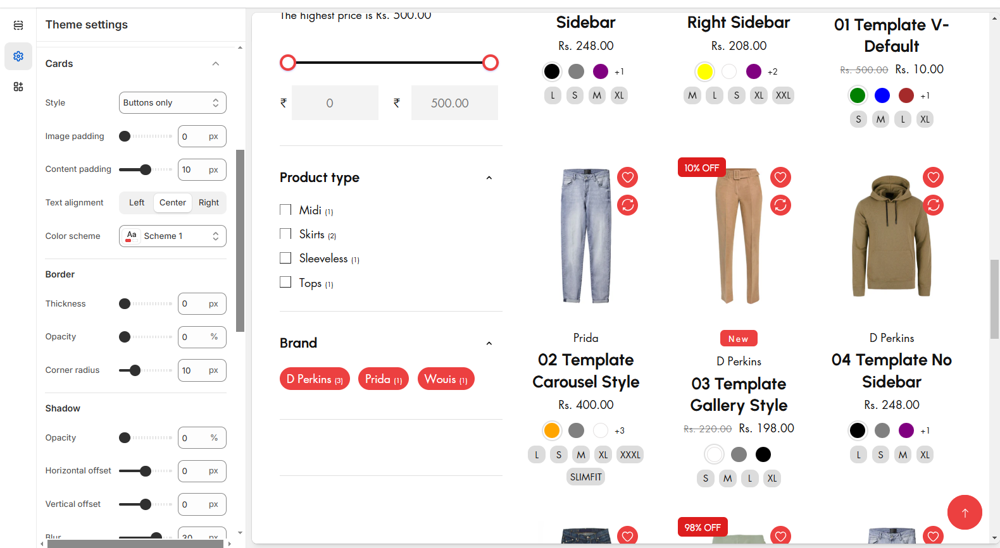

# Cards

The Cards consist of **Product cards, Collection cards, and Blog cards** allowing you to customize the style of each type of card when they're displayed in page sections. You can also customize the desired colour, alignment, image padding, borders, and shadows of these three types of section cards.


**Step 1** : From your Shopify admin, go to **Online Store > Themes**.

**Step 2** : Find the theme that you want to **Edit and Click Customize.**

**Step 3** : Click **Theme Settings.**

**Step 4 : Theme Settings > Cards.**


* The card consist of different **types of styles** can select the required style according to the theme need
* The padding of the card is adjusted using this **Image padding** and **Content padding**
* Text alignment is used align the card content alignment **(Left,Center,Right)** and color schema ensure to add color of the card
* **Border** and **Box shadow** can also be adjusted using above options.

<figure><figcaption></figcaption></figure>
