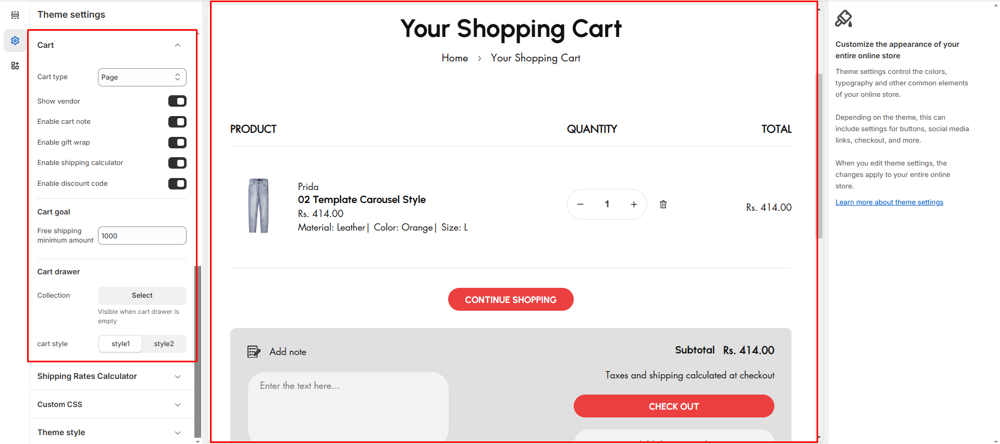

# Cart

You can change the style of the cart on your online store. When a customer adds a product from your store to their cart, the cart can be displayed as a **drawer, a page, or a pop-up notification.** To keep the customer on the product page, use the drawer or pop-up notification option. To take the customer to the cart page, use the page option. When the customer's cart is empty, you can display a featured collection in the cart drawer.


**Step 1**: From your Shopify admin, go to **Online Store > Themes.**

**Step 2**: Find the theme that you want to **Edit and click Customize**.

**Step 3**: Click **Theme Settings.**

**Step 4: Theme Settings >Cart.**



Cart have different type can use the required type as per the design.


* **Show Vendor:** The options allow you to add the vendor to the product on enable **(need to add vendoe name while creating the product)**
* **Cart note:** The options allow you to add the note that need to be enable in cart&#x20;
* **Gift wrap :** The options allow you to add the Gift wrap code that discounts from the price this option on enable **(Need to call** [**Gift Card**](../product/gift-cards.md) **in product)**
* **Shipping Calculator:** The options allow you to add [**shipping calculator**](shipping-rates-calculator.md) in the cart
* **Discount Code :** The options allow you to add discount code in the cart.
* **Cart Goal:** To enter the minimum amount for the calculating **free shipping.**
* **Cart Drawer:**&#x41;llow to add new collection to the cart.


In the cart shipping minimum amount can be added for the **free shipping** and select the collection when the cart is empty and it also have 2 style can select the style according to the theme requirements.


<figure><figcaption></figcaption></figure>
