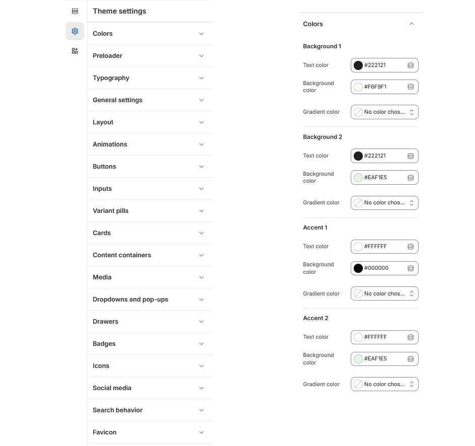

# Colors

A color scheme is a set of predefined colors used to style various components of your online store, helping to create a unique look and feel.


**Step 1** : From your Shopify admin, go to **Online Store > Themes**.

**Step 2** : Find the theme that you want to **Edit and Click Customize**.

**Step 3** : Click **Theme Settings > Colors.**


### **To customize the theme Colors, follow these steps:** 

* In the **Color** section, you’ll find more than **10 Color schemes** available. These schemes can be applied to different sections of your online store.
* To edit a color scheme, select the color scheme you want to modify.


A color scheme is a customizable set of colors that can be applied to the following elements Background gradient, Background, Text, Caption color, Solid button background, Solid button label, Outline button label, Outline button


* Finally, click _**save**._

<figure><figcaption></figcaption></figure>
