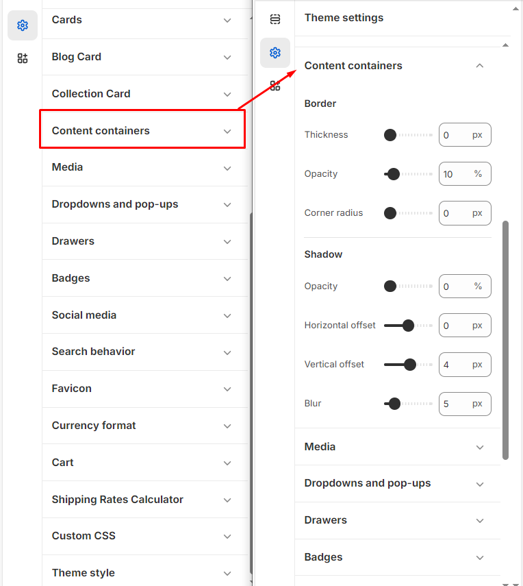

# Content Containers

**The content containers** section allows you to customize the **Border** and **Boxshadow** using multiple slider options.


**Step 1** : From your Shopify admin, go to **Online Store > Themes**.

**Step 2** : Find the theme that you want to **Edit and Click Customize.**

**Step 3** : Click **Theme Settings.**

**Step 4 : Theme Settings > Content Containers.**


The content container enables you to add border, box shadow and corner radius features to the containers

<figure><figcaption></figcaption></figure>

