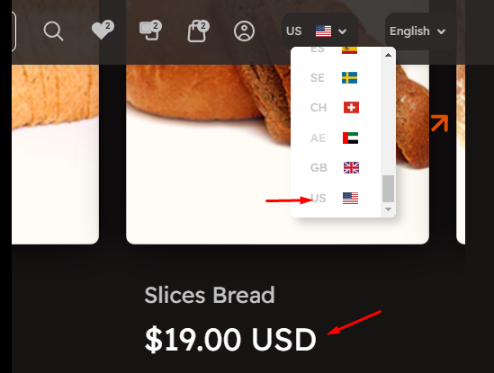
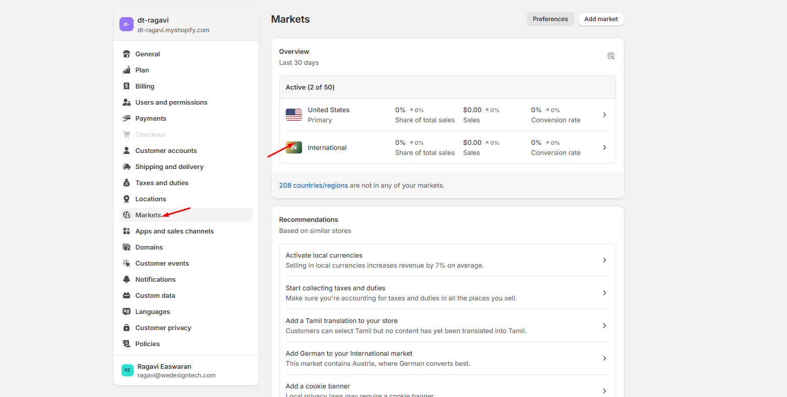
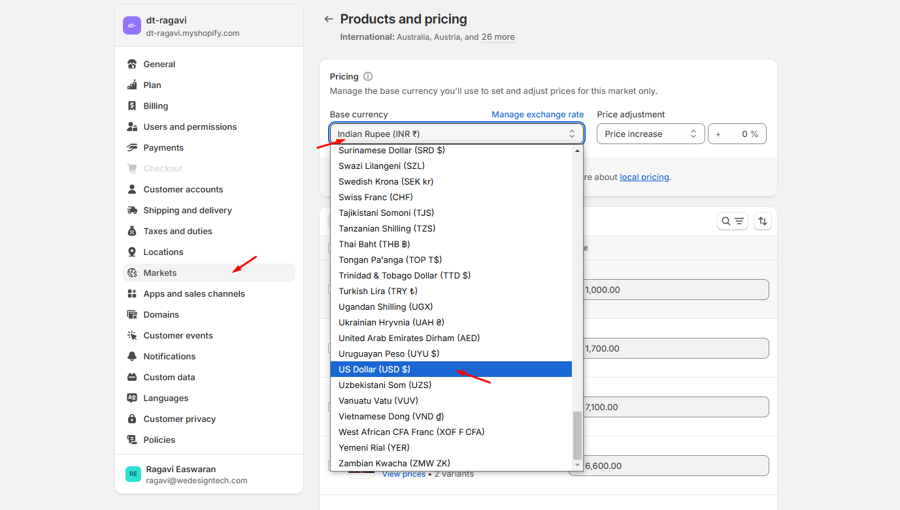
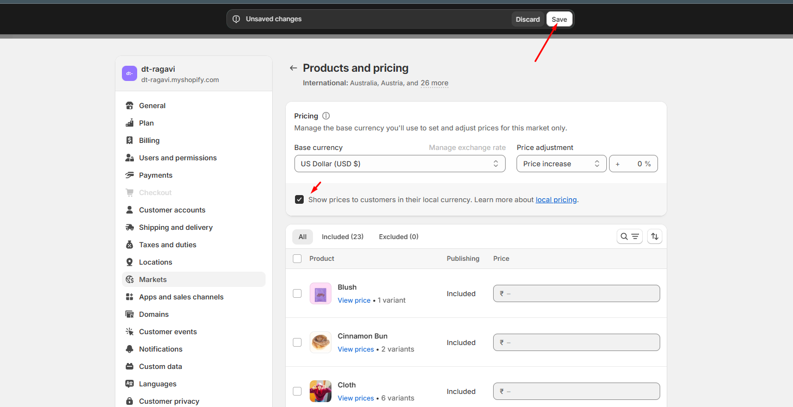
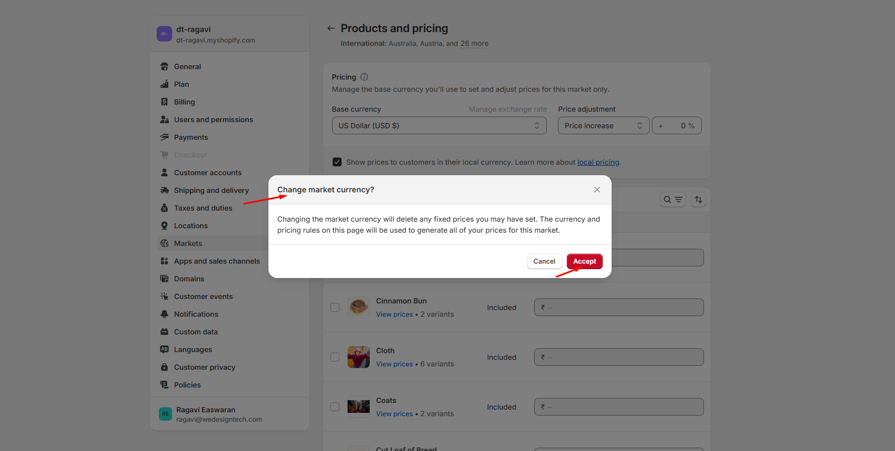

# Currency format


**Step 1:**  Go to **Shopify Admin > Settings > Markets**

**Step 2:** Click on **"International" > Then click on "Product and Pricing"**

&#x20;**Step 3:** Select US Dollar **(USD $)** and check the box to show pricing

&#x20;**Step 4:** Click the **"Save"** button at the top

&#x20;**Step 5:** A **"Change Market Currency"** popup will appear, click the **"Accept"** button.


<figure><figcaption></figcaption></figure>

### Apply Currency Format to Theme:


**Step 1:**  Go to **Shopify Admin > Online Store > Themes**

**Step 2:**  Click on **"Theme Settings" > Then go to "Currency Format" > Enable "Show currency codes" > Save**

&#x20;**Step 3:**  The currency will now be enabled in the **header (link) > Select “US” state.**

&#x20;**Step 4:**  Finally, all product currency formats should now be updated.\



<figure><figcaption></figcaption></figure>

<figure><figcaption></figcaption></figure>

<figure><figcaption></figcaption></figure>

<figure><figcaption></figcaption></figure>
