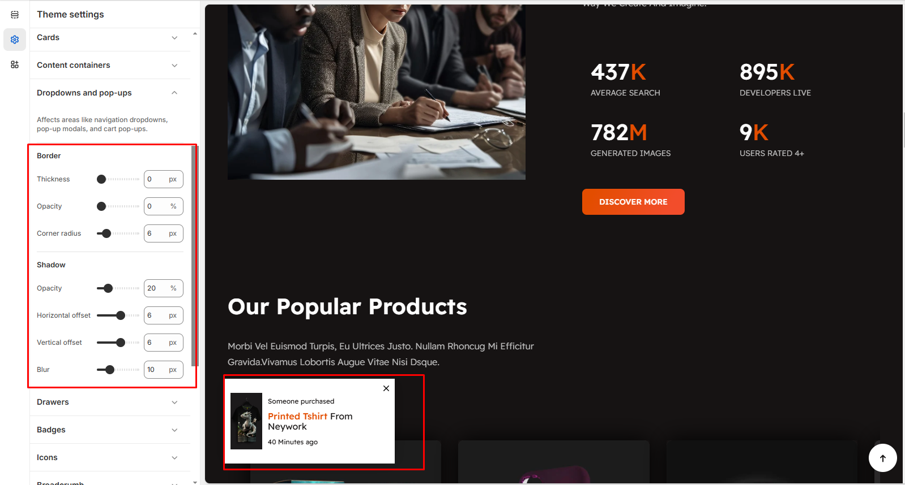

# Dropdowns and Pop-ups


* #### Navigation dropdowns (e.g., menu dropdowns)
* #### Pop-up modals (e.g., newsletter sign-ups, login pop-ups)
* #### Cart pop-ups (e.g., suggestion product,cookie banner)


* Go to **Online Store > Themes > Customize > Theme settings**
* **Border settings :** Thickness, Opacity, Corner Radius
* **Shadow settings :** Opacity, Horizontal Offset, Vertical Offset, Blur
* **Save** and preview your theme to see the changes

<figure><figcaption></figcaption></figure>

### Border Settings

These settings control the appearance of the border around each dropdown and pop-ups.

* **Thickness (px):**&#x44;efines the width of the border around the dropdowns and pop-ups. Increasing the value makes the border thicker, while setting it to 0px removes the border completely.
* **Opacity (%):**&#x43;ontrols the transparency of the border.100% makes the border fully visible, while 0% makes it completely transparent.
* **Corner Radius (px):**&#x41;djusts the roundness of the dropdowns and pop-ups corners.Higher values make the dropdowns and pop-ups more rounded, while 0px keeps them rectangular.

### &#x20;Shadow Settings

These settings add a shadow effect around each dropdowns and pop-ups, improving its depth and visibility.

* **Opacity (%):** Controls the transparency of the shadow.100% makes the shadow fully visible, while 0% removes it.
* **Horizontal Offset (px):** Moves the shadow left or right.
* **Vertical Offset (px):**&#x4D;oves the shadow up or down.Positive values push it downward, negative values lift it upward.
* **Blur (px):** Defines how soft or sharp the shadow appears.Higher values make the shadow more diffused, while lower values create a sharper edge.
