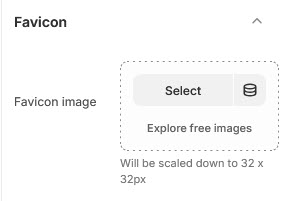

# Favicon

A favicon, or favourites icon, is a small image or logo that displays next to a web page's name. You can find favicons on your browser tabs, as well as on browser pages that list websites, such as the bookmarks page.

<figure><figcaption></figcaption></figure>


**Step 1** : From your Shopify admin, go to **Online Store > Themes.**

**Step 2** : Find the theme that you want to **Edit and Click Customize.**

**Step 3** : Click **Theme Settings.**

**Step 4 : Theme Settings > Favicon**


In this favicon section, you can insert the desired image using the 'Select Image' option to display it next to the web page’s name.

<figure><figcaption></figcaption></figure>
