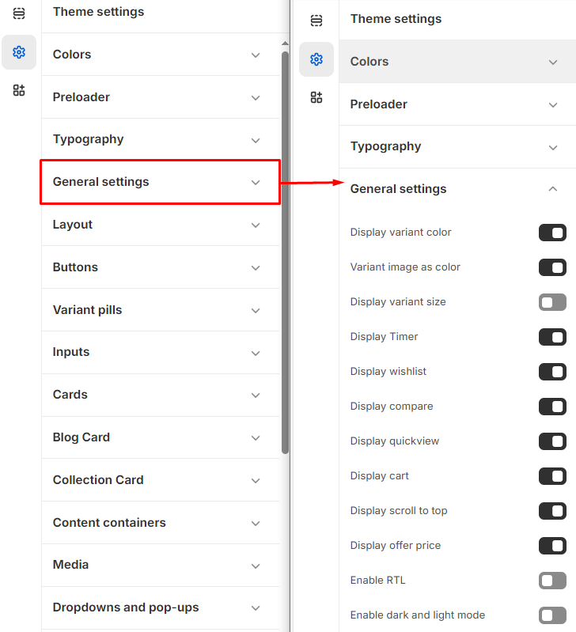

# General Settings

The General settings page allows users to customize various display options for product information and it can be applied to the following elements:'


**Step 1** : From your Shopify admin, go to **Online Store > Themes.**

**Step 2** : Find the theme that you want to **Edit and Click Customize.**

**Step 3** : Click **Theme Settings.**

**Step 4 : Theme Settings > General Settings**


### Options included 

* **Display Variant Color:** This option is used to showcase different color variants of the products.
* **Variant Image as Color:** To display variant image as desired colour.
* **Display Variant Size:** This option allows you to display the variant image in the selected color.
* **Display Timer:** This option allows you to enable or disable a timer for limited-time offers or sales[**(Show add metafield)**](../product/metafield.md).
* **Display Wishlist:** This option allows you to display or hide the button for adding items to a [**wishlist.**](../pages/wishlist.md)
* **Display Compare:**&#x54;his option allows you to show or hide the button for [**comparing** ](../pages/compare.md)products.
* **Display Quickview:**&#x54;his option allows you to enable or disable the quick view feature for products.
* **Display Cart:** Displays or hides the shopping [**cart** ](cart.md)icon.
* **Display Scroll to Top:** Shows or hides a button to scroll back to the top of the page.
* **Display Offer Price:** Displays or hides the offer price (if applicable).

<figure><figcaption></figcaption></figure>
