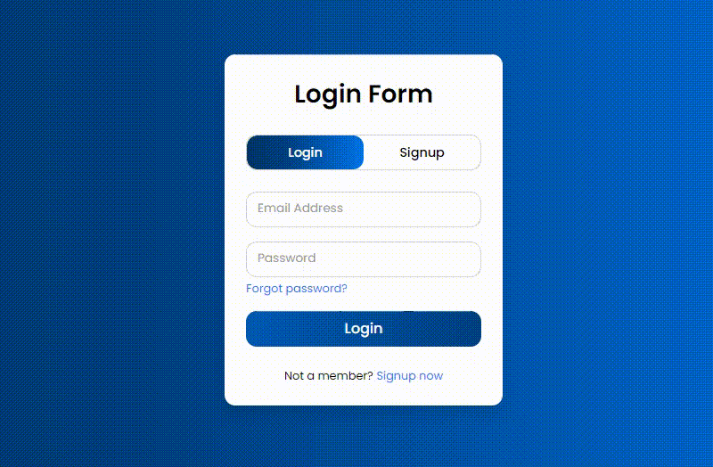

# Inputs

In Shopify, **Input Settings** refer to customizing forms and input fields such as contact forms, search bars, login forms, and checkout fields.

<figure><figcaption></figcaption></figure>


**Step 1 :** In the theme editor (**Customize**), click **Theme settings.**

**Step 2 :** Navigate to the **Inputs** section.

**Step 3 :** Make necessary changes.

**Step 4 :** Click **Save**


* **Border Box shadow** can also be adjusted using below options.

<figure><figcaption></figcaption></figure>
