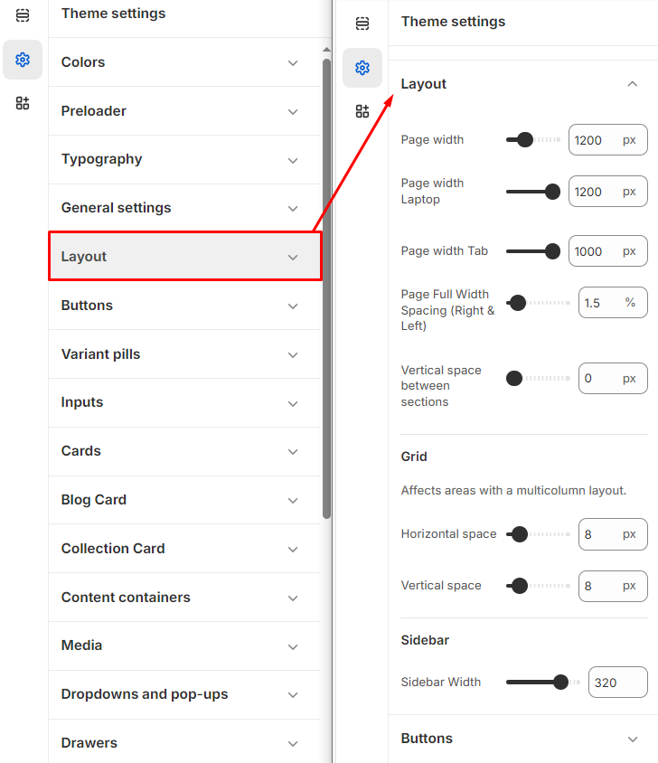

# Layout

In Shopify, the **layout** controls the overall structure and design of your store’s pages. It defines how content is displayed and ensures a consistent look across your site.


**Step 1** : From your Shopify admin, go to **Online Store > Themes.**

**Step 2** : Find the theme that you want to **Edit and Click Customize.**

**Step 3** : Click **Theme Settings.**

**Step 4 : Theme Settings > Layout**


* Layout page settings consist of **Page Width, Grid and Sidebar.**
* **Page width:** In the Page Width Option, You can set the width to the container of the page in pixels for desktop, laptop, and tablet views.
* **Right & Left Spacing :** Add **spacing** to the **Full Width** layout (applies  in full-width mode).
* **Vertical space between sections**: It controls the space between different sections of the page.
* **Grid:** This section controls the horizontal and vertical spacing within a multicolumn layout
*   **Sidebar:** This section is used to set the width of the sidebar. **(applicable in product and blog sidebars)**

    <figure><figcaption></figcaption></figure>
