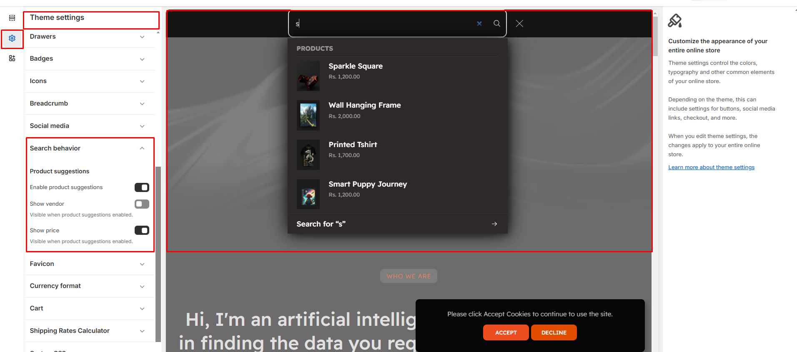

# Search Behaviour

The **Search Behavior Settings** control how products appear in search results, including **product display, filtering, and slideshow customization** for a better user experience.


**Step 1** : From your Shopify admin, go to **Online Store > Themes.**

**Step 2** : Find the theme that you want to **Edit and Click Customize.**

**Step 3** : Click **Theme Settings.**

**Step 4 : Theme Settings > Search Behavior.**


* **Enable product suggestions:** When the toggle is enabled, product suggestions will appear as users type in the search bar.
* **Show vendor:** It displays the product's vendor when enabled.
* **Show price:** It displays the product prices within the suggestions when enabled.

<figure><figcaption></figcaption></figure>

[Previous](https://wedesigntech-1.gitbook.io/ai-max/theme-settings/badges)
