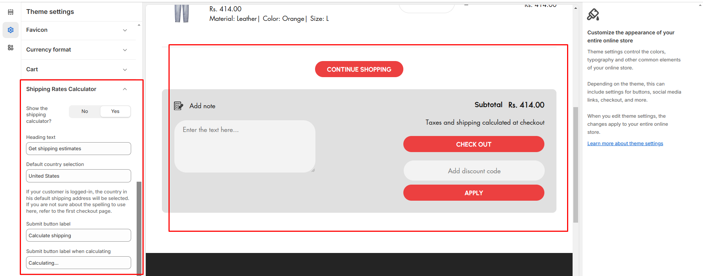
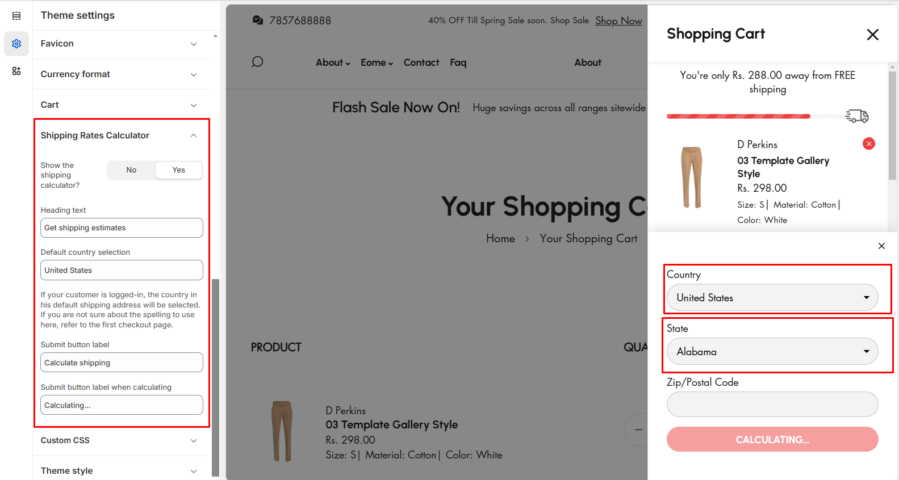

# Shipping Rates Calculator

Depending on your store's Shopify subscription plan and the order that you're shipping, you might be eligible for discounted shipping rates from [Shopify Shipping carriers](https://help.shopify.com/en/manual/fulfillment/shopify-shipping/shipping-carriers).


**Step 1** : From your Shopify admin, go to **Online Store > Themes.**

**Step 2** : Find the theme that you want to **Edit and Click Customize.**

**Step 3** : Click **Theme Settings.**

**Step 4 : Theme Settings > Shipping Rate Calculator**


<figure><figcaption></figcaption></figure>

* **Show the shipping calculator:** The  option allow to enable the shipping calculator in cart&#x20;
* **Heading:** Adds heading to the shipping calculator
* **Default Country selection:**  The option allow to enter the default country name in shipping calculator
* **Submit button label:** This option allows you to enter a custom button label for the shipping calculator
* **Submit button label on calculating:** This option allows you to enter a custom button label for the shipping calculator on calculating process.


The process is based on country which shipping charge. It works on calculating the zip code enter by the cart


<figure><figcaption></figcaption></figure>
