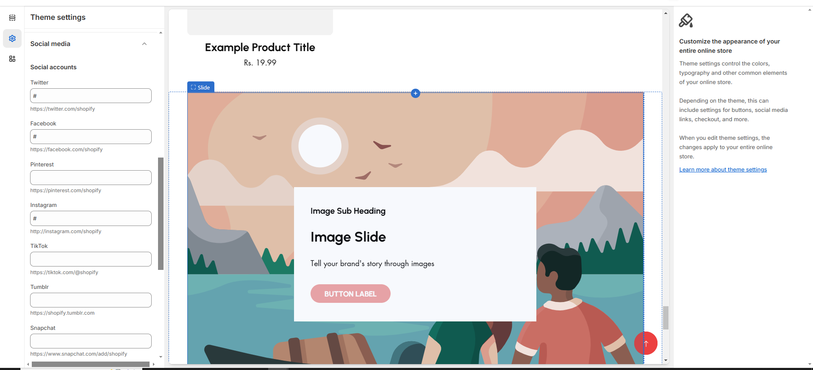

# Social Media

You can include all social media links in the theme by using the "**Social Media**" section in the theme settings. Once you enable the social icons and add the respective links, they will be displayed in the designated section, such as the footer.

<figure><figcaption></figcaption></figure>


**Step 1**: From your Shopify admin, go to **Online Store > Themes.**

**Step 2**: Find the theme that you want to **Edit and click Customize**.

**Step 3**: Click **Theme Settings.**

**Step 4: Theme Settings > Social Media**

**Note :** **When the input box empty icon will not displayed in the content**



To add links to your social media accounts, enter the website addresses for your accounts in the relevant **Social accounts** fields. You need to enter full links, such as **https://instagram.com/** shopify or **https://tiktok.com/**@shopify.


<figure><figcaption></figcaption></figure>
