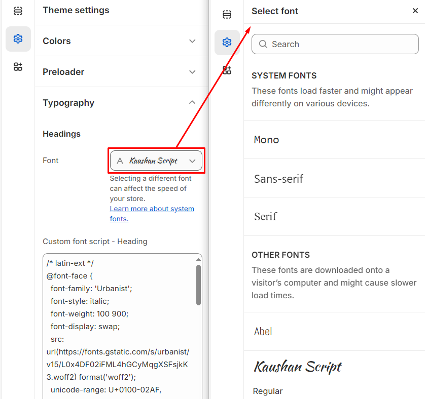
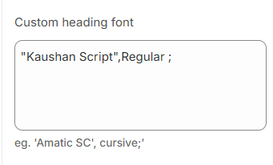

# Typography

In the typography settings, you can customize the font family for your **Headings** and **Body** text by selecting your preferred font. You can choose from **two types of fonts: Shopify fonts**, available in the **Customizer**, or **Google Fonts**, which can be searched and embedded directly from **Google**.

In Shopify, you can customize the typography settings to match your store's branding.


**Step 1** : From your Shopify admin, go to **Online Store > Themes**.

**Step 2** : Find the theme that you want to **Edit and Click Customize.**

**Step 3** : Click **Theme Settings.**

**Step 4 :** Go to **Theme Settings > Typography**


### **Shopify fonts:** 

Select Font from the customizer drop and select the required font for heading and body respectively.


Both the **Body font and Heading font** can be customized by following these steps.


### **Google fonts:**


1. **Visit Google Fonts**: Go to [Google Fonts](https://fonts.google.com) and select your desired font.
2. **Choose Styles**: Pick the styles you need (e.g., Regular, Bold).
3. **Copy Embed Code**: Under the "Embed" section, copy the `<link>` code from the "Standard" tab.
4. **Add to Shopify**:
   * Go to **Online Store** > **Themes** > **Customize** > **Theme Settings**.
   * Paste the embed code into the **Custom Heading Font** or **Body Font** box.
5. **Save Changes**: Apply the changes to update the font across your store.


### **Additional fonts:**&#x20;

* For subheadings or other text, you can use **Google Fonts** or **Shopify Fonts**.
* Follow the steps to embed the desired font in **Theme Settings**, selecting the text section you want to apply it to.

<figure><figcaption></figcaption></figure>

<figure><figcaption></figcaption></figure>

