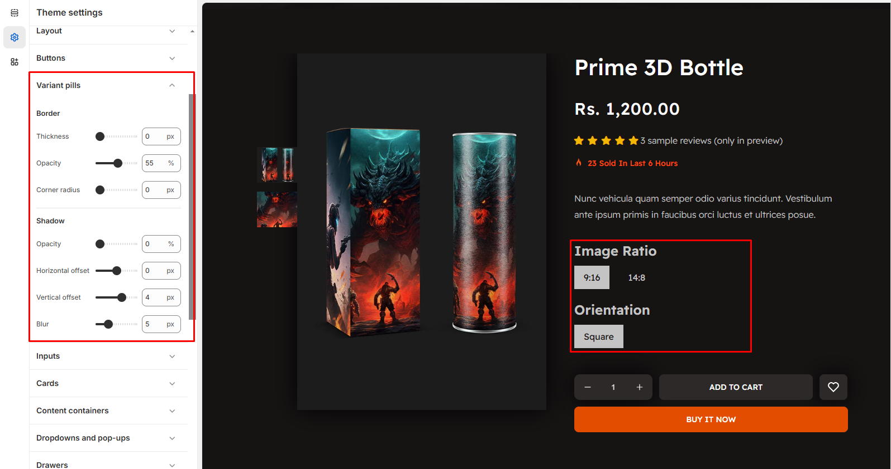

# Variant pills

When you adjust the Variant Pills settings in Shopify's theme editor, the following changes occur in the styling of variant buttons on the product page. Below is a breakdown of each option and its effect:

* Go to Online Store > Themes > Customize  > Theme settings
* Look for the Variant Pills settings under the Buttons section
* Adjust the following options as needed:
* Border settings : Thickness, Opacity, Corner Radius
* Shadow settings : Opacity, Horizontal Offset, Vertical Offset, Blur
* Save and preview your main product page to see the changes

<figure><figcaption></figcaption></figure>

### &#x20;Border Settings

These settings control the appearance of the border around each variant pill (button).

* **Thickness (px):** Defines the width of the border around the pill. Increasing the value makes the border thicker, while setting it to 0 PX removes the border completely.
* **Opacity (%):** Controls the transparency of the border.100% makes the border fully visible, while 0% makes it completely transparent.
* **Corner Radius (px):**&#x41;djusts the roundness of the pill’s corners. Higher values make the pills more rounded, while 0 PX keeps them rectangular.

### &#x20;Shadow Settings

#### These settings add a shadow effect around each variant pill, improving its depth and visibility.

* **Opacity (%):**&#x43;ontrols the transparency of the shadow. Controls the transparency of the shadow. 100% makes the shadow fully visible, while 0% removes it.
* **Horizontal Offset (px):**&#x43;ontrols the transparency of the shadow.Positive values shift it to the right, negative values shift it to the left.Positive values shift it to the right, negative values shift it to the left.
* **Vertical Offset (px):**&#x4D;oves the shadow up or down.Positive values push it downward, negative values lift it upward.
* **Blur (px):** Defines how soft or sharp the shadow appears.Higher values make the shadow more diffused, while lower values create a sharper edge.

\
